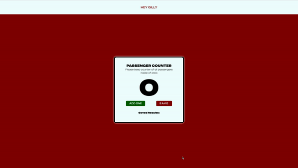

<h1 align="center">
   
  
   
  Passenger Counter
   
</h1>

<h4 align="center">
An application that will keep count of the passengers in the given area. You will be able to push the button and increase the count number.
If the save button is pushed you will hve to the ability to save past counts, so you are able to see what count was highest. 
</h4>

## Languages

The languages used to create this application:
- HTML
- CSS
- Vanilla Javascript

## Pathway

* [X] Create the HTML with Mineral material
    - including
        - Header
        - Subheader
        - number
        - two buttons
* [X] Create the style layout you want to present the page
    - Will be using only CSS for the styling
    - Reminder to make this responsive
* [X] Create the Vanilla Javascript to create the functionality
    - One function that will increase the number count
    - One function that will save the numbers and reset counter

---

> Linkedin [/HeyGilly](https://www.linkedin.com/in/heygilly) &nbsp;&middot;&nbsp;
> GitHub [@HeyGilly](https://github.com/HeyGilly) &nbsp;&middot;&nbsp;